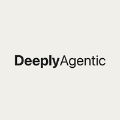
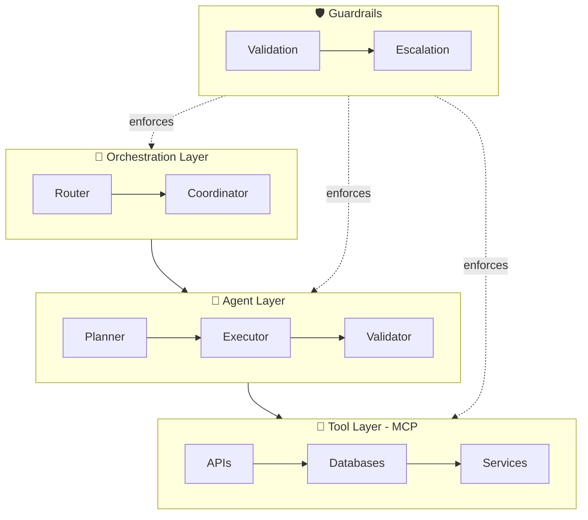

<p align="center">
  
</p>

<h1 align="center">DeeplyAgentic</h1>

<p align="center">
  <a href="https://awesome.re"></a>
  
  
  
</p>

<p align="center">
  Architecture, prompts, and tools for AI agent systems that actually work in production.<br/>
  🚀 <strong>Harness AI. Reclaim Time. Amplify Impact.</strong>
</p>

<p align="center">
  <a href="https://www.deeplyagentic.com">🌐 Website</a> ·
  <a href="https://www.linkedin.com/company/deeplyagentic">💼 LinkedIn</a> ·
  <a href="./quickstart/">⚡ Quickstart</a>
</p>

---

## 🔥 Trending This Week

| Project | Why it matters |
|---------|---------------|
| [CodeGraph](https://github.com/optave/ops-codegraph-tool) | MCP server that cuts Claude Code tool calls by 92% — pre-indexes your codebase into a knowledge graph |
| [Second-Me](https://github.com/mindverse/Second-Me) | Build your AI clone that runs fully offline — trains on your memories, deploys to decentralized networks |
| [Transformer Explainer](https://github.com/poloclub/transformer-explainer) | Interactive GPT-2 running live in your browser — see embeddings, attention, and token ranking in real time |
| [OpenAI Agents SDK](https://github.com/openai/openai-agents-python) | Official lightweight multi-agent framework from OpenAI — handoffs, tools, guardrails built in |
| [Kimi-K2](https://github.com/MoonshotAI/Kimi-K2) | MoE model with 32B active / 1T total parameters — open-source frontier reasoning |

---

## Get Started

```bash
# Option A: Local (no API keys needed)
git clone https://github.com/Mehtabk/DeeplyAgentic.git
cd DeeplyAgentic/quickstart
pip install ollama && python multi_agent_pipeline_ollama.py

# Option B: Cloud (OpenAI)
export OPENAI_API_KEY=your-key
uv run multi_agent_pipeline.py
```

---

## Projects

| Project | Description |
|---------|-------------|
| [**⚡ Quickstart**](./quickstart/) | Run a multi-agent pipeline (Planner → Executor → Validator) in 5 minutes. |
| [**📚 The Agentic Stack**](./the-agentic-stack/) | Curated tools for production agent systems — organized by architecture layer. |
| [**🧠 Agent Prompts**](./agent-prompts/) | Production-ready system prompts — Planner, Executor, Validator, Orchestrator, Summarizer. |
| [**🔍 Comparisons**](./comparisons/) | Side-by-side framework comparison: CrewAI vs AutoGen vs LangGraph vs OpenAI SDK vs Mastra. |
| [**✅ Checklists**](./checklists/) | Pre-launch checklist for agent systems. Don't ship without it. |
| [**📐 Diagrams**](./diagrams/) | Copy-paste Mermaid diagrams for agent architectures. |
| [**📝 Agent Decisions**](./agent-decisions/) | Architecture Decision Records (ADRs) for agent systems. |
| [**📖 Reading List**](./reading-list/) | Curated papers, reports, talks, and courses. Updated weekly. |

---

## The 4-Layer Architecture

> Most agent projects fail not because of bad models — but because of missing architecture.



---

## Key Stats (May 2026)

| Stat | Source |
|------|--------|
| 80% of enterprise apps embed at least one AI agent | Gartner Q1 2026 |
| 40% of agentic AI projects cancelled without architecture | Gartner |
| 1,600+ agents per enterprise by year-end | IBM 2026 |
| 1,445% surge in multi-agent inquiries | Gartner |

---

## Contributing

We welcome contributions! See individual project folders for guidelines.

**Quick ways to contribute:**
- 🐛 Found a broken link? Open an issue
- 📚 Know a tool that belongs here? Submit a PR
- ⭐ Star this repo to help others find it

---

MIT License © 2026 DeeplyAgentic
