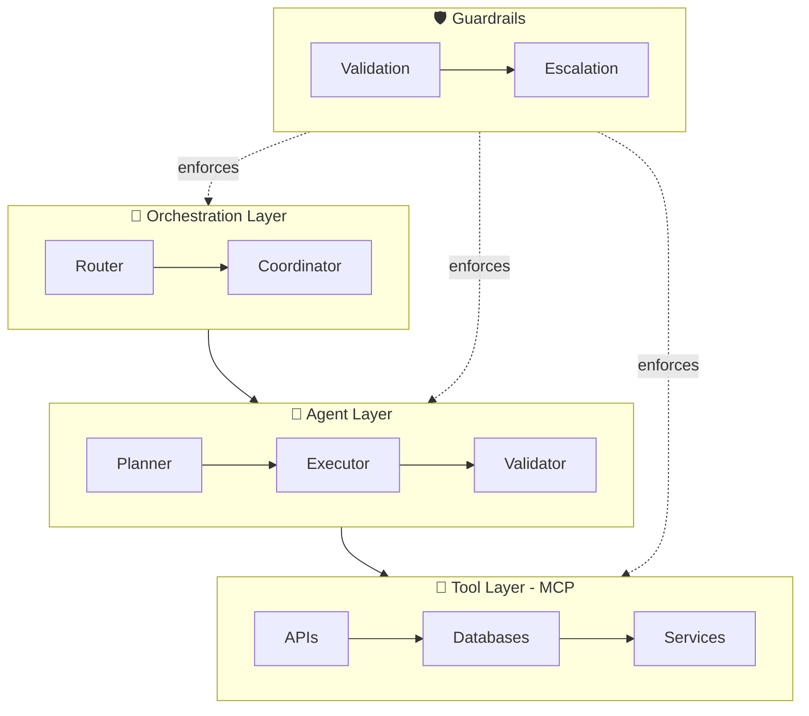

<p align="center">
  
</p>

<h1 align="center">DeeplyAgentic</h1>

<p align="center">
  Building smart, scalable AI agent systems that do the heavy lifting.<br/>
  🚀 <strong>Harness AI. Reclaim Time. Amplify Impact.</strong>
</p>

---

## Get Started

```bash
git clone https://github.com/Mehtabk/DeeplyAgentic.git
cd DeeplyAgentic/quickstart
uv run multi_agent_pipeline.py
```

---

## Projects

| Project | Description |
|---------|-------------|
| [**Quickstart**](./quickstart/) | Run a multi-agent pipeline (Planner → Executor → Validator) in 5 minutes. |
| [**The Agentic Stack**](./the-agentic-stack/) | Curated tools for production agent systems — organized by architecture layer. |
| [**Agent Prompts**](./agent-prompts/) | Production-ready system prompts — Planner, Executor, Validator, Orchestrator, Summarizer. |
| [**Comparisons**](./comparisons/) | Side-by-side framework comparison: CrewAI vs AutoGen vs LangGraph vs OpenAI SDK vs Mastra. |
| [**Checklists**](./checklists/) | Pre-launch checklist for agent systems. Don't ship without it. |
| [**Diagrams**](./diagrams/) | Copy-paste Mermaid diagrams for agent architectures. |
| [**Agent Decisions**](./agent-decisions/) | Architecture Decision Records (ADRs) for agent systems. |
| [**Reading List**](./reading-list/) | Curated papers, reports, talks, and courses. Updated weekly. |

---

## The 4-Layer Architecture



---

## Why This Exists

Most agent projects fail not because of bad models — but because of missing architecture.

- 80% of enterprise apps shipped in Q1 2026 embed at least one AI agent (Gartner)
- 40% of agentic AI projects predicted to be cancelled by 2027 without proper architecture (Gartner)
- 1,600+ agents per enterprise expected by end of 2026 (IBM)

This repo is our contribution to fixing that.

---

## Contributing

We welcome contributions. See individual project folders for guidelines, or use the [issue template](https://github.com/Mehtabk/DeeplyAgentic/issues/new/choose) to suggest resources.

---

## Connect

- [LinkedIn](https://www.linkedin.com/company/deeplyagentic)
- 📍 Würzburg, DE | Doha, QA

---

MIT License © 2026 DeeplyAgentic
