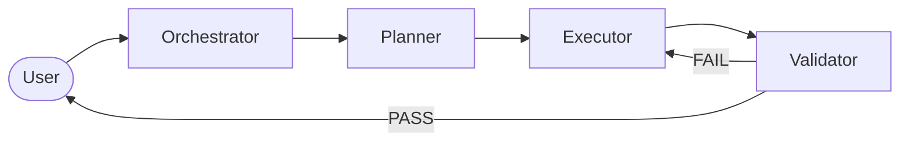
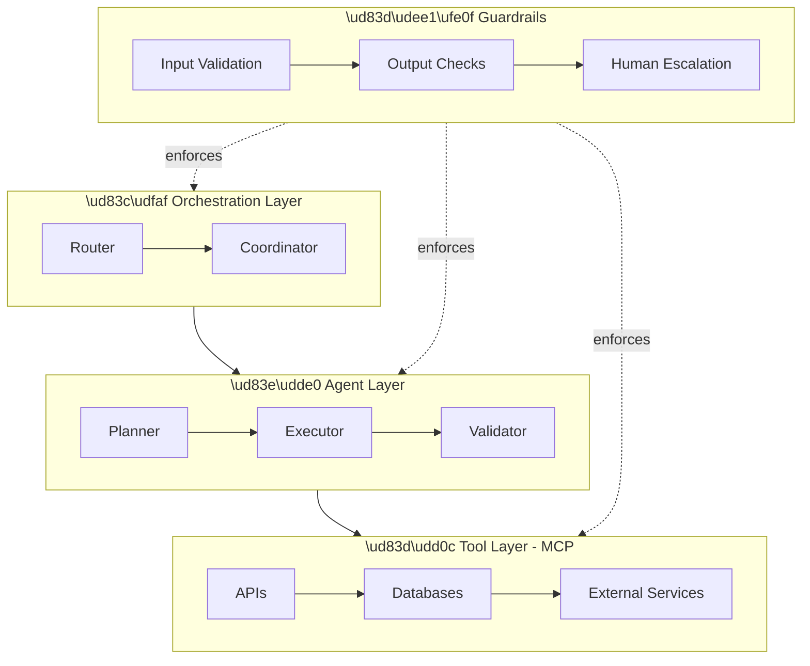
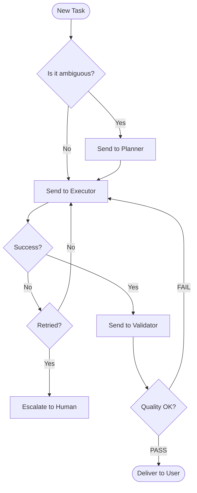
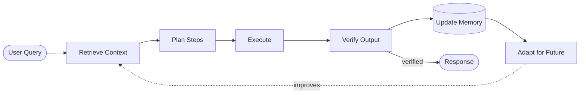
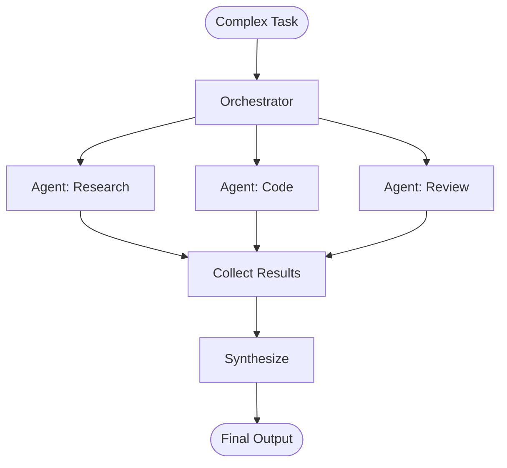

# Agent Architecture Diagrams

> Copy-paste Mermaid diagrams for agent system design. Use in docs, PRs, and presentations.

## Multi-Agent Pipeline

## The 4-Layer Stack

## Agent Decision Flow

## Agentic RAG Flow

## Multi-Agent Orchestration (Fan-out/Fan-in)

---

## How to Use

These diagrams render natively on GitHub, Notion, and most documentation tools.

To use in your own docs:
1. Copy the mermaid code block
2. Paste into any markdown file
3. It renders automatically on GitHub

For presentations, use [mermaid.live](https://mermaid.live) to export as PNG/SVG.
